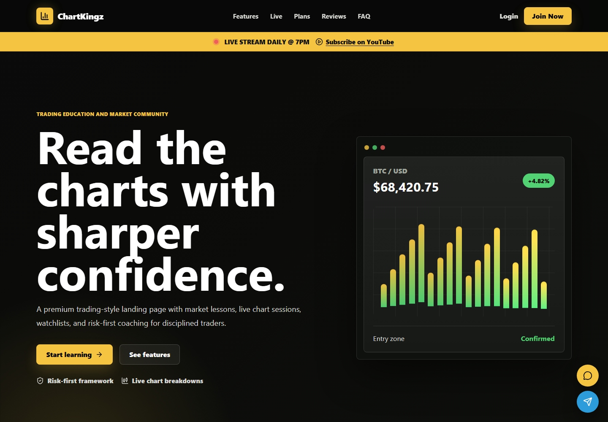
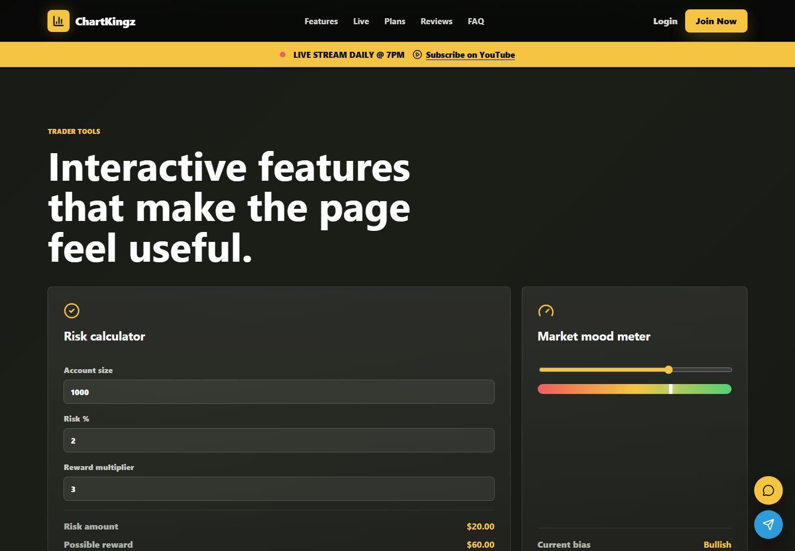
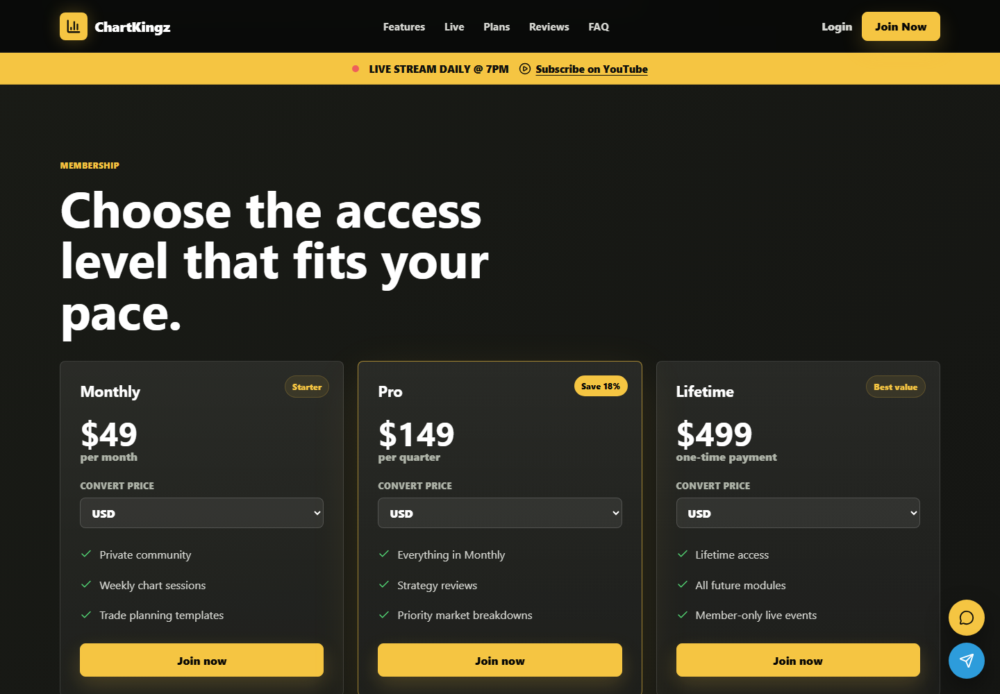
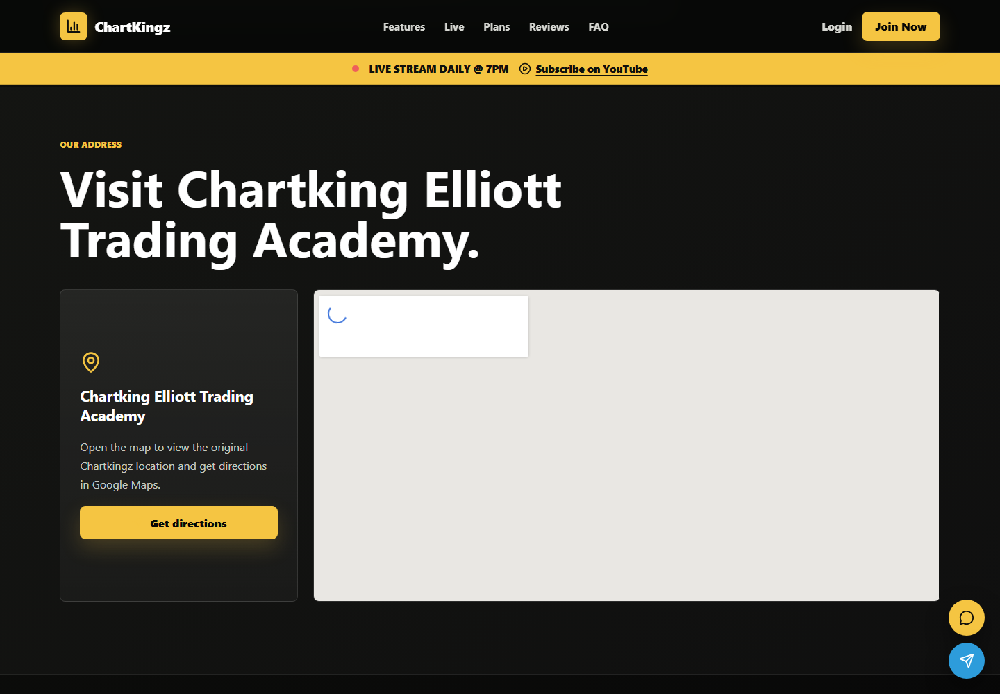

# ChartKingz Clone



> A premium trading academy landing page built with **React**, **Vite**, **JavaScript**, and custom **CSS**.  
> It recreates a ChartKingz-inspired experience with live-stream energy, trading tools, membership cards, social links, and a location map.

## Live Feel

This project is designed to feel like a modern trading education platform, not just a static landing page. It includes animated market visuals, interactive calculators, conversion tools, and conversion-focused sections for a polished academy-style website.

## Built With


## Screenshots

### Hero Experience


### Interactive Trader Tools



### Pricing With Currency Converter



### Location Map



## Interesting Features

- **Sticky YouTube Live Banner**  
  A bold announcement strip for the daily live stream at `7 PM`.

- **Countdown Timer**  
  Automatically counts down to the next daily live session.

- **Animated Trading Hero**  
  A dark dashboard-style hero with animated chart bars and trading signal details.

- **Market Watchlist Cards**  
  Includes BTC, ETH, NIFTY, GOLD, and NASDAQ style price cards.

- **YouTube Video Preview Section**  
  A cinematic video block for live classes or market breakdowns.

- **Trading Glossary**  
  Quick educational cards for support, resistance, breakout, risk reward, and stop loss.

- **Pricing Currency Converter**  
  Each pricing card can convert USD into INR, EUR, GBP, AED, or CAD.

- **Risk Calculator**  
  Calculates risk amount and possible reward based on account size, risk percentage, and reward multiplier.

- **Market Mood Meter**  
  Interactive slider that changes the market bias between bearish, neutral, and bullish.

- **Trading Style Quiz**  
  Simple quiz buttons that show what type of trader the visitor might be.

- **Pre-Trade Checklist**  
  A practical checklist to help users validate trade readiness.

- **Course Roadmap Progress**  
  Progress bars for market structure, Fibonacci planning, risk management, and trading psychology.

- **Google Location Map**  
  Embedded map section inspired by the original ChartKingz address block.

- **Footer Social Links**  
  Instagram, Facebook, Twitter, LinkedIn, and YouTube icons open in new tabs.

- **Floating Contact Buttons**  
  WhatsApp and Telegram quick-action buttons stay available on the page.

## Project Structure

```text
kingzclone/
  docs/
    screenshots/
  src/
    components/
      Countdown.jsx
      FAQ.jsx
      Features.jsx
      FloatingActions.jsx
      Footer.jsx
      Glossary.jsx
      Hero.jsx
      LiveBanner.jsx
      LocationMap.jsx
      MarketTicker.jsx
      Navbar.jsx
      Pricing.jsx
      Stats.jsx
      Testimonials.jsx
      TraderTools.jsx
      VideoPreview.jsx
    App.jsx
    index.css
    main.jsx
  index.html
  package.json
```

## Run Locally

```bash
npm install
npm run dev
```

Open:

```text
http://127.0.0.1:5173
```

## Production Build

```bash
npm run build
```

Preview the build:

```bash
npm run preview
```

## Customization Ideas

- Replace placeholder social links with official profile URLs.
- Connect pricing buttons to a real payment page.
- Add a real YouTube embed for the daily live stream.
- Connect the currency converter to a live exchange-rate API.
- Replace sample testimonials with real student reviews.

## Disclaimer

This project is for educational and portfolio purposes. It does not provide financial advice, investment recommendations, or guaranteed trading outcomes.

---

**Copyright © 2026 Chartkingz.**
